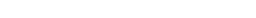

# Realm of the Mad God (RotMG) Bot

## State Space Description

### Natural Language Description

In this project, a state space is a complete set of all possible situations the bot can find itself in while traversing the world of Realm of the Mad God. Each state describes everything the bot needs to know to make an informed decision. These decisions fall into three main categories: 
* Navigation: Determining where and how to move avoid adversaries, or path towards objectives
* Combat: Choosing when to engage, dodge projectiles, retreat, or target enemies
* Looting: Deciding when and how to pick up items, avoid traps, or evaluate whether it's safe

A single state will include: 
* The bot's current position
* The bot's HP and MP
* The positions of observable enemies, their behaviors, and type
* The positions and behaviors of projectiles and an associated threat level
* The location of nearby items or loot bags
* The location of dungeons
* The observable map layout
* The current inventory and stats of the bot

By representing the current situation as a state, the bot can evaluate actions and choose the one most likely to maximize its long-term success.

### Mathematical Description

Markov Decision Processes (MDP) are used to model the environment and used for navigation in conjunction with A*/Dijkstra's. Q-learning is used for combat and decision-making under uncertainty so that the bot can learn to adapt to enemy behaviors and boss patterns. 

#### Markov Decision Processes (MDP)

We can model the decision-making process for the RotMG as an MDP:

  

Each state $s \in S$ in the decision process encodes the following:
* Bot's position $p_{bot} = (x_{bot},y_{bot})$
* Bot's health $h_{bot} \in [0,H_{max}]$
* Bot's mana $m_{bot} \in [0,M_{max}]$
* Bot's inventory ${inv}_{bot} = \{item_1, item_2, item_3, ...\}$
* Bot's stats ${stats} = \{{ATT},{DEF},{SPD},{DEX},{VIT},{WIS}\}$
* Nearby enemies positions $p_{enemy} = \{(x_{enemy\_1},y_{enemy\_1}), (x_{enemy\_2},y_{enemy\_2}),(x_{enemy\_3},y_{enemy\_3}), ...\}$
* Nearby enemy health $h_{enemy} \in [0,H_{enemy\_max}]$
* Bot's Orientation $\theta_{bot} \in [0, 2\pi)$
* Environment State ${map} = \{(x_{obs},y_{obs})\}$  
* Position of observable dungeons $p_{dgn} = \{(x_{dgn\_1},y_{dgn\_1}), (x_{dgn\_2},y_{dgn\_2}),(x_{dgn\_3},y_{dgn\_3}), ...\}$
* Action History $a_{history} = \{a_1,a_2,a_3,...,a_n\}$

Given the state variables, an MDP for the RotMG bot could be formalized as follows:

  

The action space $A$ of the bot would include legal actions $a$ the bot can take:

  

The transition function $P(s'|s,a)$ can describe the new position of the bot after moving, the updated health after an attack, etc.
The reward function $R(s,a)$ could include rewards for successfully evading an attack, killing enemy, or looting item.

#### Q-learning

In Q-learning, the Q-value $(s_t,a_t)$ will be updated based on the bot's experience. The current state can be formalized the same as MDP:

  

The action space $A$ is also the same as the action space in MDP:

  

The reward value would update based on the outcome of an action $a_t$. For example:
* $r_{t + 1} = +1$ for killing an enemy
* $r_{t + 1} = -1$ for taking damage

The Q-value update rule would be as follows:

  

The bot uses the maximum Q-value for the next state and updates its Q-value accordingly to improve future decisions. For exmaple, if the bot's health $h_{bot}$ drops below a threshold after an enemy attack, it may update the Q-values for actions like "dodge" or "retreat" more favorably.

